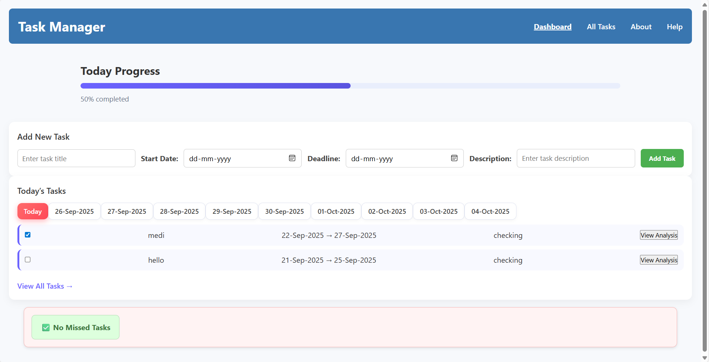
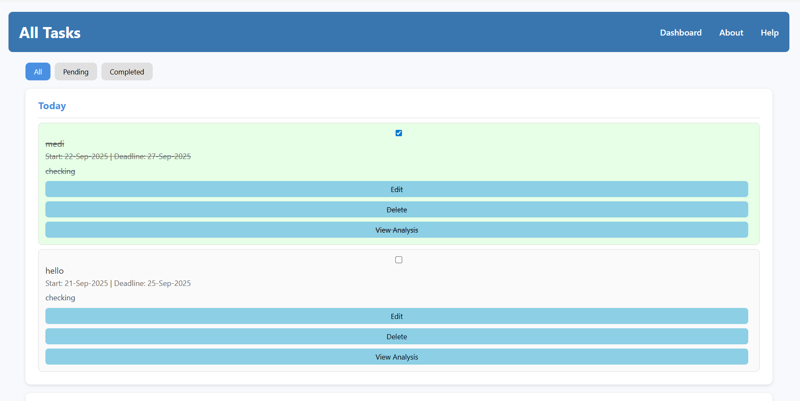
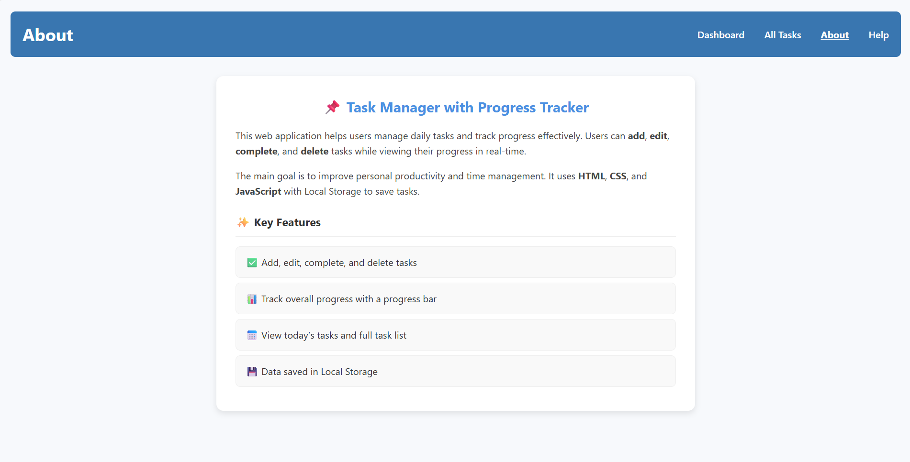
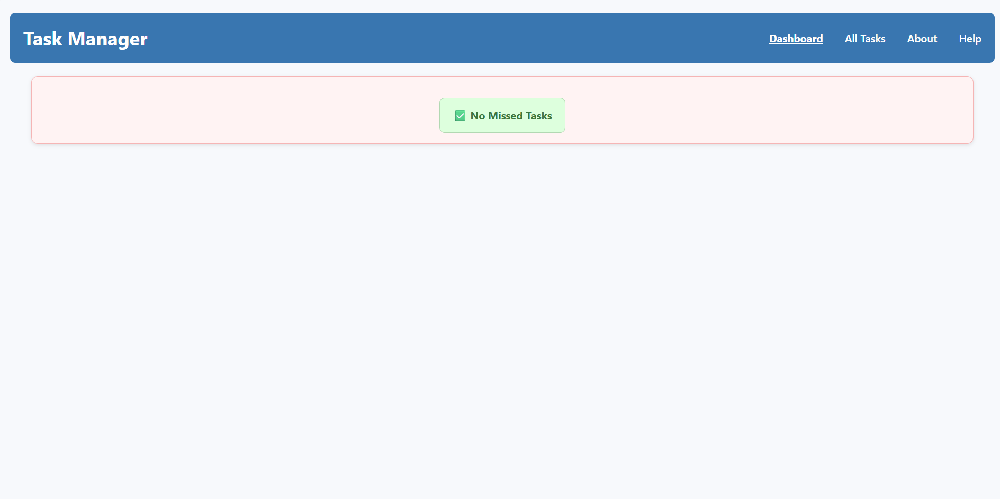

# 📌 Task Manager with Progress Tracker

A lightweight **web-based task manager** built using **HTML, CSS, and JavaScript**.  
It helps users **add, edit, complete, and track tasks** with a progress bar, daily task view, and consistency insights.  
All data is stored in **Local Storage** — no backend required.

---

## 🚀 Features

- ✅ Add, edit, complete, and delete tasks  
- 📅 View tasks by **Today, Tomorrow, Upcoming, and All Tasks**  
- 📊 Progress bar to track completion percentage  
- 🔥 Consistency tracking with completion history  
- ❌ **Missed Task Recovery** → auto-moves overdue tasks to “Missed” section with reschedule option  
- 🔎 Filters: All | Pending | Completed  
- 💾 Offline support (Local Storage)  

---

## 🖼 Screenshots

### Dashboard


### All Tasks


### Task Detail


### Missed Tasks


> *(Add your own screenshots inside a `screenshots/` folder in the repo)*

---

## 🛠️ Tech Stack

- **Frontend**: HTML, CSS, JavaScript  
- **Storage**: Local Storage (browser)  
- **Deployment**: GitHub Pages and Netlify  

---

## ⚙️ Installation & Usage

1. Clone the repository:
   ```bash
   git clone https://github.com/Bharathi7890/Task-Manager-App.git
   cd task-manager
